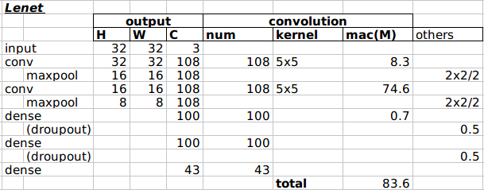
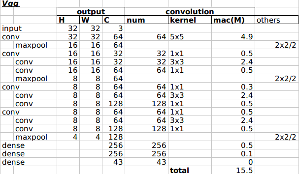
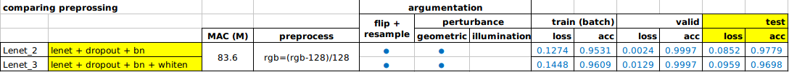
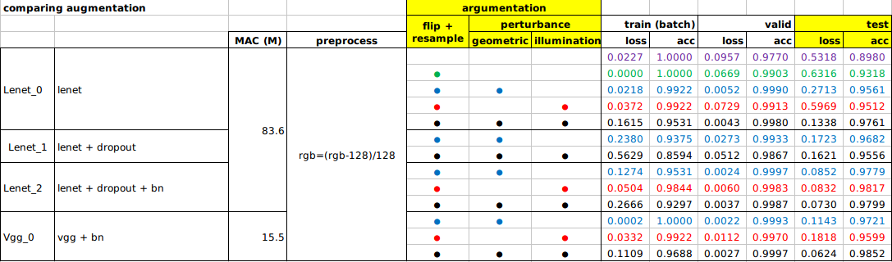
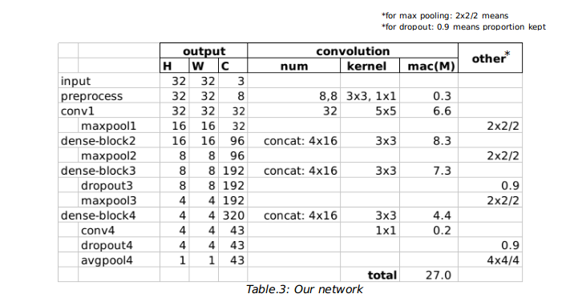
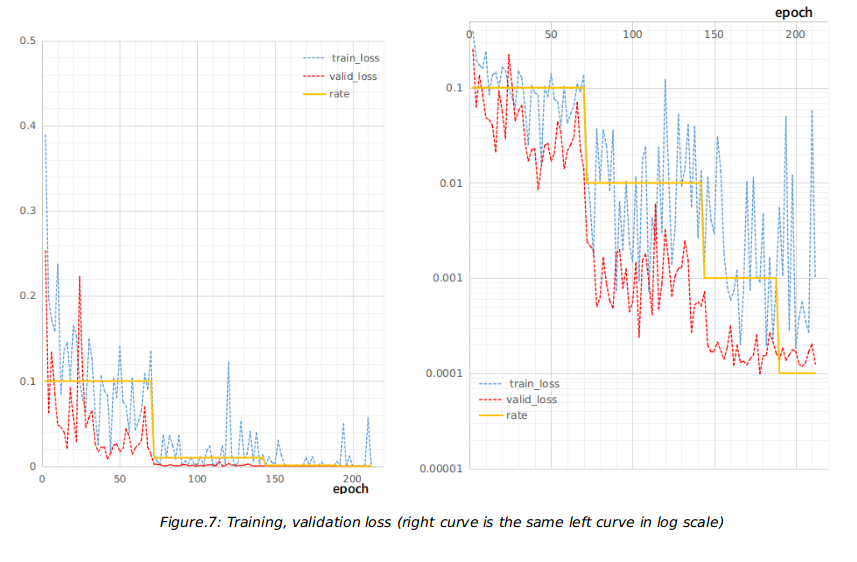
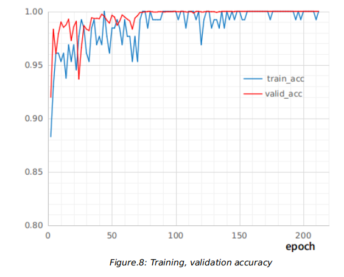
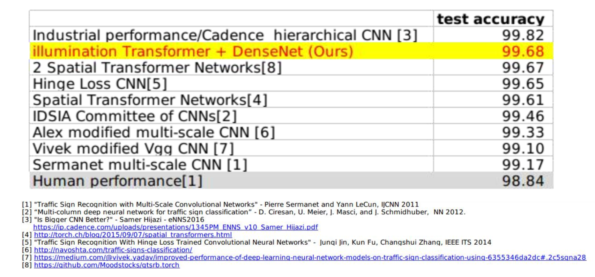

**# udacity-driverless-car-nd-p2**

This is my work for the Self-Driving Car Engineer Nanodegree ND-013 course project, "2.Traffic Sign Classifier" . The project problem can be found here: [https://github.com/udacity/CarND-Traffic-Sign-Classifier-Project](https://github.com/udacity/CarND-Traffic-Sign-Classifier-Project)

---
## Basic solution
Please see the "basic" folder. 

Let us look at the data (the second column is the mean image of each class):
/002/out/train_data_summary.jpg)

Here is the basic solution using LeNet and Vgg.

---
## Advance solution
Please see the "advance" folder. 

There is some write up at my blog: 

[https://medium.com/@hengcherkeng/updated-my-99-40-solution-to-udacity-nanodegree-project-p2-traffic-sign-classification](https://medium.com/@hengcherkeng/updated-my-99-40-solution-to-udacity-nanodegree-project-p2-traffic-sign-classification-5580ae5bd51f#.da1xutkw2)

[https://medium.com/@hengcherkeng/updated-my-99-68-solution-to-udacity-nanodegree-project-p2-traffic-sign-classification](https://medium.com/@hengcherkeng/updated-my-99-68-solution-to-udacity-nanodegree-project-p2-traffic-sign-classification-56840768dec8#.g377ckv5z)

I use modified densenet[1] and obtained **99.68%** on the test set. 
The network complexity is about **27.0 million MAC** (multiply–accumulate operation counts). 

Here is my network structure. Each "Dense block" consists of concatenation of convolutions (in conv-bn-relu). Note that unlike the paper, dropout is not applied in the block. Instead, I use droupout after the block.

 

Here is the MAC computation

Finally, the loss curves are shown below.

### [Reference]
[1] "Densely Connected Convolutional Networks" - Gao Huang, Zhuang Liu, Kilian Q. Weinberger, Laurens van der Maaten, Arxiv 2016
